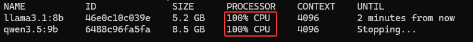
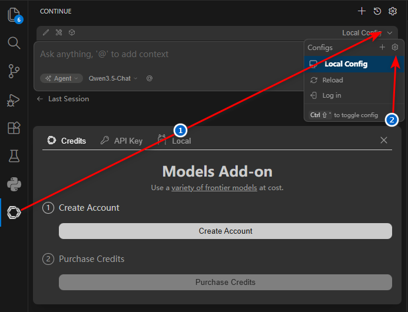
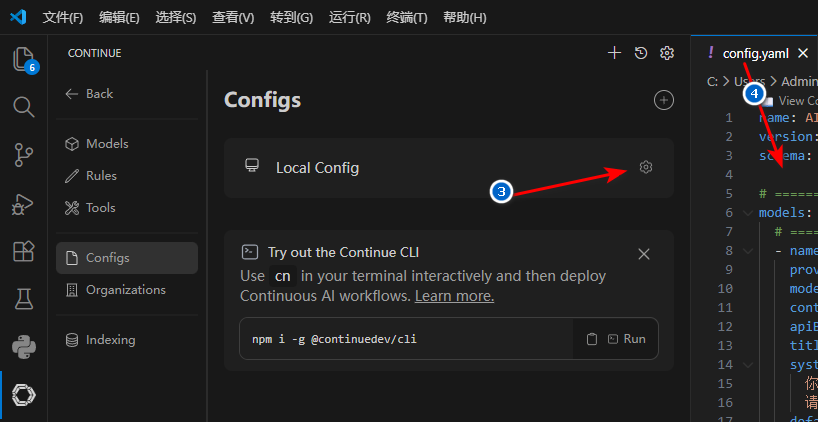

# ollama_user_guide
ollama使用指引(自用引导)

注意AND显卡和NVIDIA显卡要下载不同的ollama版本，自行去[github下载](https://github.com/ollama/ollama)  
还有一个[AMD特供版下载地址](https://github.com/likelovewant/ollama-for-amd),不知道是不是与上面的下载包一样，自行去验证

显卡支持列表:[官网查看](https://docs.ollama.com/gpu#amd-radeon)  
如果不在官方支持列表，[请参考:](https://www.oneue.com/articles/2350.html)  
执行`ollama ps`命令发现如下图CPU100%，[请参考](https://zhuanlan.zhihu.com/p/2024786075583804463)  
  

[ollama官网查看可用模型列表：](https://ollama.com/search)

### 查看模型列表：
`ollama list`
### 安装模型：
`ollama pull qwen3.5:9b`  
`ollama pull llama3.1:8b`
### 运行模型：
`ollama run qwen3.5:9b`  
`ollama run llama3.1:8b`
### 删除模型：
`ollama rm llama3:8b`  
`ollama rm llama3:8b qwen2.5:7b`
### 删除模型后 清理缓存和残留文件：
`ollama prune`
### 查看所有运行中的模型
`ollama ps`  
- 1.如果模型已停止，输出为空
- 2.如果模型还在运行，会显示详细信息
### 停止指定模型
`ollama stop qwen3:4b`
### 停止所有运行中的模型
`ollama stop --all`
### Windows：在任务管理器中结束Ollama进程或者重启Ollama服务也可停止所有运行中的模型
- 然后重新启动`ollama serve`

## 关联项目，编写代码
- Ollama + Continue组合，适合喜欢白嫖用户。
- Continue 是一款开源的AI代码助手插件，支持VS Code和JetBrains IDE
### 第一步：安装Continue插件
1. 在VS Code中：
- 打开扩展市场（Ctrl+Shift+X）
- 搜索 "Continue"
- 选择官方插件 "Continue - Dev" 并安装
2. 在JetBrains IDE中：
- 打开插件市场（Settings → Plugins）
- 搜索 "Continue"
- 安装并重启IDE
### 第二步：配置config.yaml文件
1. 打开Continue配置文件进行编辑
- 命令行方式
1. 在VS Code中按 Ctrl+Shift+P
2. 输入 "Continue: Open Config File"
3. 选择 "config.yaml"
- 面板操作方式，参考下图步骤  
  

2. 配置模型，以下仅供参考，具体请自行找AI帮你配置
```
name: AI Programming Assistant
version: 1.0.0
schema: v1

# ========== 模型配置 ==========
models:
  # ===== Qwen3.5:9b - 主力聊天模型 =====
  - name: Qwen3.5-Chat
    provider: ollama
    model: qwen3.5:9b
    contextLength: 32768
    apiBase: http://localhost:11434
    title: "Qwen3.5 (聊天/分析)"
    systemPrompt: |
      你是一个专业的AI编程助手，专注于代码理解、项目分析和问题解决。
      请提供清晰、准确、实用的技术建议。
    default: true
    params:
      temperature: 0.7
      top_p: 0.9
      num_predict: 2048

  # ===== Llama3.1:8b - 代码补全专用 =====
  - name: Llama3.1-Coder
    provider: ollama
    model: llama3.1:8b
    contextLength: 8192
    apiBase: http://localhost:11434
    title: "Llama3.1 (代码补全)"
    systemPrompt: |
      你是一个代码补全专家，专注于提供准确、高效的代码建议。
      请根据上下文提供最合适的代码片段。
    params:
      temperature: 0.2
      top_p: 0.95
      num_predict: 512

# ========== 上下文配置 ==========
context:
  # 项目代码上下文（核心配置）
  - provider: code
    params:
      maxFiles: 50          # 最大文件数
      maxChars: 100000      # 最大字符数
      includePatterns:      # 包含的文件类型
        - "*.py"
        - "*.java"
        - "*.js"
        - "*.ts"
        - "*.go"
        - "*.cpp"
        - "*.h"
        - "*.cs"
        - "*.rb"
        - "*.php"
        - "*.rs"
        - "*.kt"
        - "*.swift"
      excludePatterns:      # 排除的目录
        - "node_modules"
        - ".git"
        - "build"
        - "dist"
        - "venv"
        - "__pycache__"
        - ".venv"
        - "target"
        - "out"
        - ".idea"
        - ".vscode"
        - "*.min.js"
        - "*.min.css"

  # 文档上下文
  - provider: docs
    params:
      includePatterns:
        - "README.md"
        - "docs/*.md"
        - "CONTRIBUTING.md"
        - "CHANGELOG.md"
        - "*.md"

  # Git差异上下文
  - provider: diff

  # 终端命令上下文
  - provider: terminal

  # 当前文件上下文
  - provider: file

# ========== 自动补全配置 ==========
autocomplete:
  enabled: true
  model: Llama3.1-Coder      # 使用Llama3.1进行代码补全
  maxLines: 10
  debounceMs: 100
  temperature: 0.2

# ========== 聊天配置 ==========
chat:
  model: Qwen3.5-Chat        # 使用Qwen3.5进行聊天
  systemPrompt: |
    你是一个专业的AI编程助手，专注于：
    1. 代码理解与分析
    2. 项目架构设计
    3. 错误诊断与修复
    4. 代码重构与优化
    5. 技术文档编写
    
    请提供清晰、准确、实用的技术建议。

# ========== 编辑配置 ==========
edit:
  model: Qwen3.5-Chat        # 使用Qwen3.5进行代码编辑
  temperature: 0.5

# ========== 性能优化配置 ==========
performance:
  maxContextChars: 50000
  maxFilesPerContext: 30
  cacheEnabled: true
  cacheSize: 100

# ========== 自定义命令配置 ==========
customCommands:
  - name: "代码解释"
    prompt: "请详细解释以下代码的功能、逻辑和关键点：\n{{code}}"
    description: "解释选中的代码"
  
  - name: "代码优化"
    prompt: "请优化以下代码，提高性能和可读性：\n{{code}}"
    description: "优化选中的代码"
  
  - name: "添加注释"
    prompt: "请为以下代码添加详细的中文注释：\n{{code}}"
    description: "为代码添加注释"
  
  - name: "生成测试"
    prompt: "请为以下函数生成单元测试：\n{{code}}"
    description: "生成单元测试代码"
  
  - name: "重构代码"
    prompt: "请重构以下代码，使其更符合最佳实践：\n{{code}}"
    description: "重构代码结构"

# ========== 快捷键配置 ==========
keybindings:
  # VS Code快捷键映射
  acceptCompletion: "Tab"
  rejectCompletion: "Escape"
  triggerChat: "Ctrl+Shift+L"
  triggerEdit: "Ctrl+Shift+E"
```
